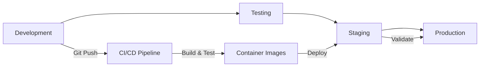

# HomeOps Infrastructure Design
**Version 1.0** | **Date: August 24, 2025**

---

## Executive Summary

This document defines the infrastructure architecture for HomeOps, detailing hardware utilization, network topology, deployment strategies, and operational procedures. The design prioritizes reliability through redundancy, performance through optimal resource allocation, and security through defense-in-depth principles.

---

## Hardware Infrastructure

### Primary System: AMD Ryzen 9 7950X Workstation

#### Hardware Specifications
```yaml
CPU:
  Model: AMD Ryzen 9 7950X
  Cores: 16 physical cores
  Threads: 32 logical threads
  Base Clock: 4.5 GHz
  Boost Clock: 5.7 GHz
  TDP: 170W (configurable)
  
Memory:
  Capacity: 64GB DDR5
  Speed: 5600 MHz
  Configuration: 2x32GB dual-channel
  ECC: No (consumer platform)
  
GPU:
  Model: NVIDIA RTX 4080
  VRAM: 16GB GDDR6X
  CUDA Cores: 9,728
  Tensor Cores: 304 (3rd gen)
  Usage: AI inference, video transcoding
  
Storage:
  System Drive: 2TB NVMe Gen4 SSD
  Data Drive: 4TB NVMe Gen4 SSD
  Backup Drive: 8TB HDD
  Media Storage: 16TB HDD
  
Network:
  Primary: 2.5GbE onboard
  Secondary: 1GbE onboard
  WiFi: WiFi 6E capable
  
Cooling:
  CPU: Noctua NH-D15
  Case: High airflow design
  Target: <70°C under load
```

#### Resource Allocation Strategy

```yaml
CPU Core Assignment:
  System Reserved: 2 cores (OS, background tasks)
  Database Services: 4 cores (PostgreSQL, Redis)
  Core Services: 4 cores (Central Agent, API Gateway)
  Specialized Services: 4 cores (Financial, Media, Smart Home)
  Burst Capacity: 2 cores (Gaming optimization, batch jobs)
  
Memory Allocation:
  System/OS: 8GB
  Database Layer: 12GB
    - PostgreSQL: 8GB
    - Redis: 2GB
    - TimescaleDB: 2GB
  Application Services: 20GB
    - Central Agent: 4GB
    - API Services: 8GB
    - Worker Processes: 8GB
  Container Overhead: 4GB
  File System Cache: 8GB
  GPU Shared Memory: 8GB
  Reserve/Burst: 4GB
  
Storage Partitioning:
  System (C:\): 500GB SSD
  Docker/WSL2: 500GB SSD
  Databases: 1TB SSD
  Application Data: 1TB SSD
  Logs/Metrics: 500GB SSD
  Media Library: 16TB HDD
  Backups: 8TB HDD
```

### Backup System: Synology NAS

#### Specifications
```yaml
Model: Synology DS920+ (or equivalent)
CPU: Intel Celeron J4125 (4 cores)
Memory: 8GB DDR4 (expanded)
Storage: 4x8TB in RAID 5 (24TB usable)
Network: 2x1GbE with link aggregation
```

#### Service Allocation
```yaml
Primary Services:
  - Backup Pi-hole DNS
  - Time Machine backups
  - Media file storage
  - Database backups
  - Docker registry mirror
  
Failover Services (Activated on Primary Failure):
  - Critical API endpoints
  - Health monitoring
  - Alert notifications
  - Basic automation
```

---

## Network Architecture

### Network Topology

```
Internet (Quantum Fiber)
    │
    ├── Static IP: XXX.XXX.XXX.XXX
    │
    ▼
[Edge Router/Firewall]
    │
    ├── DMZ Network (10.0.1.0/24)
    │   └── Public-facing services (if any)
    │
    ├── Main LAN (10.0.10.0/24)
    │   ├── Primary Workstation (10.0.10.10)
    │   ├── NAS Backup System (10.0.10.20)
    │   ├── Smart Home Devices (10.0.10.100-199)
    │   └── Family Devices (10.0.10.200-250)
    │
    ├── IoT VLAN (10.0.20.0/24)
    │   └── Isolated smart devices
    │
    └── Guest Network (10.0.30.0/24)
        └── Visitor access (isolated)
```

### Network Segmentation

#### VLAN Configuration
```yaml
VLAN 1 - Management:
  ID: 1
  Subnet: 10.0.1.0/24
  Purpose: Network equipment management
  Access: Admin only
  
VLAN 10 - Production:
  ID: 10
  Subnet: 10.0.10.0/24
  Purpose: Main HomeOps services
  Access: Authenticated users
  
VLAN 20 - IoT:
  ID: 20
  Subnet: 10.0.20.0/24
  Purpose: Smart home devices
  Access: Restricted, no internet for some devices
  
VLAN 30 - Guest:
  ID: 30
  Subnet: 10.0.30.0/24
  Purpose: Guest access
  Access: Internet only, isolated from other VLANs
```

### DNS Architecture

```yaml
Primary DNS (Main Workstation):
  IP: 10.0.10.10
  Service: Pi-hole in Docker
  Upstream DNS: 
    - 1.1.1.1 (Cloudflare)
    - 8.8.8.8 (Google)
  Features:
    - Ad blocking
    - Local domain resolution
    - Query logging
    - Custom blocklists
    
Secondary DNS (NAS):
  IP: 10.0.10.20
  Service: Pi-hole in Docker
  Configuration: Synced from primary
  Activation: Automatic on primary failure
  
Tertiary DNS (Fallback):
  IP: 10.0.10.1 (Router)
  Service: Router DNS cache
  Purpose: Emergency fallback only
```

### VPN Configuration

```yaml
VPN Service: NordVPN via Gluetun
Container: gluetun/gluetun:latest

Selective Routing:
  Through VPN:
    - Trading services
    - Media downloading
    - External API calls
    - Web scraping
    
  Direct Connection:
    - Local network traffic
    - Gaming traffic
    - Voice/video calls
    - Speed-critical services
    
Kill Switch: Enabled
DNS over TLS: Enabled
Port Forwarding: As needed for services
```

---

## Container Infrastructure

### Docker Architecture

```yaml
Docker Host Configuration:
  Platform: WSL2 on Windows 11
  Distribution: Ubuntu 22.04 LTS
  Docker Version: 25.x
  Compose Version: 2.x
  Storage Driver: overlay2
  Network Driver: bridge
  
Resource Limits:
  WSL2 Memory: 32GB
  WSL2 CPU: 12 cores
  Swap: 8GB
  Disk: 500GB
```

### Container Organization

```yaml
Network Structure:
  homeops_default:
    Driver: bridge
    Subnet: 172.20.0.0/16
    
  homeops_internal:
    Driver: bridge
    Internal: true
    Subnet: 172.21.0.0/16
    
  homeops_external:
    Driver: bridge
    Subnet: 172.22.0.0/16
    
Service Groups:
  Core Services:
    Network: homeops_default
    Containers:
      - central-agent
      - api-gateway
      - agent-orchestrator
      
  Data Layer:
    Network: homeops_internal
    Containers:
      - postgres
      - redis
      - timescaledb
      
  External Services:
    Network: homeops_external
    Containers:
      - gluetun
      - nginx
      - pihole
```

### Container Registry Strategy

```yaml
Image Management:
  Public Images:
    Registry: Docker Hub
    Pull Policy: Always for latest, IfNotPresent for tagged
    
  Private Images:
    Registry: GitHub Container Registry
    Authentication: GitHub Personal Access Token
    Naming: ghcr.io/username/homeops/*
    
  Local Development:
    Registry: Local Docker daemon
    Tagging: homeops/*:dev
    
Image Security:
  Scanning: Trivy for vulnerability detection
  Base Images: Official or verified publishers only
  Updates: Automated via Dependabot
```

---

## Deployment Architecture

### Deployment Pipeline



### Deployment Strategy

```yaml
Blue-Green Deployment:
  Purpose: Zero-downtime updates
  Process:
    1. Deploy to green environment
    2. Run health checks
    3. Switch traffic to green
    4. Keep blue as rollback
    5. Cleanup after validation
    
Rolling Updates:
  Purpose: Gradual service updates
  Process:
    1. Update one instance
    2. Health check
    3. Update next instance
    4. Continue until complete
    
Canary Deployment:
  Purpose: Risk mitigation for major changes
  Process:
    1. Deploy to 10% of instances
    2. Monitor metrics
    3. Gradual rollout if healthy
    4. Full rollback if issues
```

### Environment Configuration

```yaml
Development:
  Location: Local machine
  Database: PostgreSQL in Docker
  Services: All in Docker Compose
  Data: Synthetic test data
  
Staging:
  Location: Isolated Docker network
  Database: Replica of production
  Services: Full stack deployed
  Data: Anonymized production data
  
Production:
  Location: Primary workstation
  Database: Supabase + local PostgreSQL
  Services: Distributed across containers
  Data: Live production data
```

---

## Scaling Strategy

### Vertical Scaling

```yaml
Immediate Capacity (Current Hardware):
  CPU: Can utilize all 32 threads under load
  Memory: Can expand to 128GB if needed
  Storage: Can add additional NVMe/SATA drives
  
Performance Optimization:
  - CPU boost policies for burst performance
  - Memory page compression
  - Storage tiering (SSD for hot data, HDD for cold)
  - GPU acceleration for appropriate workloads
```

### Horizontal Scaling

```yaml
Service Replication:
  Stateless Services:
    - API Gateway: Up to 4 instances
    - Worker Services: Up to 8 instances
    - Web Frontend: Up to 3 instances
    
  Load Balancing:
    - Round-robin for API requests
    - Least connections for WebSocket
    - Sticky sessions where needed
    
Future Expansion:
  - Additional NAS units for storage
  - Dedicated mini-PC for specific services
  - Cloud bursting for peak loads
```

### Performance Optimization

```yaml
Caching Strategy:
  L1 Cache: In-memory application cache
  L2 Cache: Redis for session/data cache
  L3 Cache: CDN for static assets (future)
  
Database Optimization:
  - Connection pooling (max 100 connections)
  - Query optimization and indexing
  - Materialized views for complex queries
  - Partitioning for time-series data
  
Network Optimization:
  - HTTP/2 for multiplexing
  - WebSocket for real-time data
  - Compression for API responses
  - Keep-alive connections
```

---

## Disaster Recovery Plan

### Backup Strategy

```yaml
Backup Schedule:
  Configuration:
    Frequency: Real-time sync
    Retention: 30 versions
    Location: NAS + Cloud
    
  Database:
    Frequency: Every 4 hours
    Retention: 7 days local, 30 days cloud
    Method: pg_dump + WAL archiving
    
  Application Data:
    Frequency: Daily
    Retention: 7 days local, 90 days cloud
    Method: Incremental backups
    
  Media Files:
    Frequency: Weekly
    Retention: Until manually deleted
    Method: Rsync to NAS
```

### Recovery Procedures

```yaml
Service Recovery Priority:
  Priority 1 (< 5 minutes):
    - DNS services
    - Authentication service
    - Health monitoring
    
  Priority 2 (< 30 minutes):
    - Central Agent
    - API Gateway
    - Database services
    
  Priority 3 (< 2 hours):
    - Financial services
    - Smart home integration
    - Media services
    
  Priority 4 (< 24 hours):
    - Analytics
    - Batch processing
    - Non-critical automation
```

### Failure Scenarios

```yaml
Scenario 1 - Primary System Failure:
  Detection: Health checks fail for 60 seconds
  Response:
    1. Automatic DNS failover to NAS
    2. Activate backup services on NAS
    3. Notify administrator
    4. Begin recovery procedures
    
Scenario 2 - Network Failure:
  Detection: Internet connectivity lost
  Response:
    1. Local services continue operation
    2. Queue external API calls
    3. Use cached data where possible
    4. Process queued items when restored
    
Scenario 3 - Data Corruption:
  Detection: Integrity checks fail
  Response:
    1. Stop affected services
    2. Restore from latest backup
    3. Replay transaction logs
    4. Verify data integrity
```

---

## Security Infrastructure

### Network Security

```yaml
Firewall Rules:
  Inbound:
    - 443/tcp: HTTPS (rate limited)
    - 80/tcp: HTTP (redirect to HTTPS)
    - 22/tcp: SSH (key-only, IP restricted)
    - 53/udp: DNS (internal only)
    
  Outbound:
    - Allow established connections
    - Block unnecessary ports
    - Log suspicious activity
    
IDS/IPS:
  - Fail2ban for brute force protection
  - Snort for intrusion detection
  - ModSecurity for web application firewall
```

### Access Control

```yaml
Authentication:
  Method: JWT tokens
  Expiration: 15 minutes (access), 7 days (refresh)
  Storage: Secure HTTP-only cookies
  MFA: TOTP for admin access
  
Authorization:
  Model: Role-Based Access Control (RBAC)
  Roles:
    - Admin: Full system access
    - User: Standard functionality
    - Guest: Read-only access
    - Service: Inter-service communication
```

### Monitoring & Alerting

```yaml
Security Monitoring:
  - Failed authentication attempts
  - Unusual API activity patterns
  - File integrity monitoring
  - Network traffic anomalies
  - Container security scanning
  
Alert Channels:
  Critical: SMS + Push notification
  High: Email + Dashboard
  Medium: Dashboard + Logs
  Low: Logs only
```

---

## Operational Procedures

### Maintenance Windows

```yaml
Scheduled Maintenance:
  Window: Sundays 2-4 AM
  Frequency: Monthly
  Activities:
    - System updates
    - Database maintenance
    - Log rotation
    - Backup verification
    
Emergency Maintenance:
  Notification: 15 minutes advance when possible
  Scope: Minimal required changes
  Rollback: Always have rollback plan
```

### Monitoring Dashboard

```yaml
Key Metrics:
  System Health:
    - Service availability
    - Response times
    - Error rates
    - Resource utilization
    
  Business Metrics:
    - Active automations
    - Tasks processed
    - API calls made
    - Cost optimization
    
  Security Metrics:
    - Authentication attempts
    - API rate limits
    - Threat detection
    - Compliance status
```

### Runbook Examples

```yaml
DNS Failover Procedure:
  Trigger: Primary DNS unresponsive
  Steps:
    1. Verify primary DNS is down
    2. Check NAS backup DNS status
    3. Update DHCP to point to backup
    4. Monitor client connections
    5. Investigate primary failure
    6. Document incident
    
Database Recovery Procedure:
  Trigger: Database corruption detected
  Steps:
    1. Stop application services
    2. Backup corrupted database
    3. Restore from latest backup
    4. Apply transaction logs
    5. Verify data integrity
    6. Restart services
    7. Monitor for issues
```

---

## Capacity Planning

### Growth Projections

```yaml
6-Month Forecast:
  Data Growth: +100GB
  API Calls: +50% increase
  Service Count: +5 new services
  Storage Needs: +2TB
  
12-Month Forecast:
  Data Growth: +500GB
  API Calls: +200% increase
  Service Count: +10 new services
  Storage Needs: +8TB
  
Resource Triggers for Expansion:
  CPU: Sustained >80% utilization
  Memory: >85% utilization
  Storage: <20% free space
  Network: >70% bandwidth usage
```

### Expansion Options

```yaml
Short-term (< $500):
  - Add 64GB RAM
  - Add 4TB NVMe SSD
  - Add 16TB HDD
  
Medium-term (< $2000):
  - Secondary NAS unit
  - Dedicated mini-PC for services
  - 10GbE network upgrade
  
Long-term (< $5000):
  - Second workstation for redundancy
  - Professional NAS upgrade
  - Cloud hybrid deployment
```

---

## Cost Optimization

### Resource Efficiency

```yaml
Power Management:
  - Dynamic CPU frequency scaling
  - Disk spin-down for idle drives
  - Wake-on-LAN for remote access
  - Scheduled service scaling
  
Service Optimization:
  - Container resource limits
  - Automatic service scaling
  - Batch processing scheduling
  - Cache effectiveness monitoring
  
Cost Monitoring:
  - Electricity usage tracking
  - Cloud service costs (if any)
  - API usage costs
  - Hardware depreciation
```

---

## Compliance & Standards

### Data Privacy

```yaml
GDPR Compliance (Future Community Features):
  - Data minimization
  - Right to erasure
  - Data portability
  - Consent management
  
Personal Data Protection:
  - Encryption at rest
  - Encrypted backups
  - Access logging
  - Regular audits
```

### Industry Standards

```yaml
Security Standards:
  - OWASP Top 10 compliance
  - CIS Docker Benchmark
  - NIST Cybersecurity Framework
  
Operational Standards:
  - ITIL service management
  - DevOps best practices
  - SRE principles
```

---

## Conclusion

This infrastructure design provides a robust, scalable, and secure foundation for HomeOps operations. The architecture emphasizes:

1. **Reliability** through redundancy and automated failover
2. **Performance** through optimal resource allocation
3. **Security** through defense-in-depth approach
4. **Scalability** through modular design
5. **Efficiency** through automation and optimization

The infrastructure is designed to grow with needs while maintaining operational simplicity and cost-effectiveness for a personal-scale deployment.

---

**Document Control**
- **Author**: System Architect Agent
- **Version**: 1.0
- **Last Updated**: August 24, 2025
- **Next Review**: Post-implementation validation