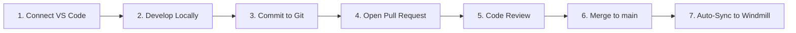

# HomeOps - Windmill Infrastructure as Code (IaC)

**Autonomous Orchestration Platform**

This directory is the **single source of truth** for all HomeOps platform-level orchestration workflows. All changes to infrastructure automation, system monitoring, deployment orchestration, and maintenance tasks are managed as code through Git and automatically synchronized to the Windmill execution engine.

---

## 🚀 The Golden Path

**ALL changes to orchestration logic MUST follow this Git-driven workflow.**

**🚫 DO NOT make changes directly in the Windmill UI.** The UI is for read-only monitoring and debugging only.

### Development Workflow



#### Step-by-Step Process

1. **Connect VS Code**
   - Install the [Windmill VS Code extension](https://marketplace.visualstudio.com/items?itemName=windmill-labs.windmill)
   - Configure connection to the `homeops-platform` workspace
   - See [SETUP-GUIDE.md](./SETUP-GUIDE.md) for detailed instructions

2. **Develop Locally**
   - Create or edit **Flows** (`.yaml` files) in `flows/` directory
   - Create or edit **Scripts** (`.ts` files) in `scripts/` directory
   - Test your changes locally using the Windmill CLI or extension

3. **Commit to Git**
   - Create a feature branch: `git checkout -b feature/your-workflow-name`
   - Commit your changes with descriptive messages
   - Push to GitHub: `git push origin feature/your-workflow-name`

4. **Open Pull Request**
   - Create a PR on GitHub
   - Include description of what workflows are added/changed and why

5. **Code Review**
   - Team reviews the orchestration logic
   - Ensures workflows follow best practices and security guidelines

6. **Merge to main**
   - After approval, merge the PR to `main` branch

7. **Auto-Sync to Windmill**
   - GitHub Actions automatically runs `windmill-sync.yml`
   - Your workflows are deployed to the `homeops-platform` workspace
   - Monitor deployment in the Actions tab

---

## 📂 Directory Structure

```
windmill/
├── README.md                          # This file - overview and quick start
├── SETUP-GUIDE.md                    # Detailed setup instructions
├── WORKSPACE-ARCHITECTURE.md         # Workspace separation strategy
├── windmill.config.yaml              # Platform configuration
├── .env.example                      # Environment variables template
│
├── flows/                            # Workflow definitions (.yaml files)
│   ├── infrastructure/               # Docker, system health, service management
│   ├── deployment/                   # Deployment orchestration
│   ├── monitoring/                   # System-wide monitoring and alerting
│   └── maintenance/                  # Scheduled cleanup, backups, updates
│
├── scripts/                          # Reusable functions (.ts files)
│   ├── platform/                     # Shared platform utilities
│   └── integrations/                 # External service integrations
│
└── resources/                        # Resource definitions (.yaml files)
    ├── databases/                    # Database connections
    └── services/                     # External service configurations
```

### Flow vs Script - When to Use What?

| **Flows** (`.yaml`) | **Scripts** (`.ts`) |
|---------------------|---------------------|
| High-level orchestration | Single, focused logic |
| Multi-step processes | Reusable functions |
| Coordinate multiple scripts | Data transformations |
| Schedule-driven automation | API integrations |
| Event-driven workflows | Utility operations |

**Example Flow**: `docker-health-monitoring.yaml` - Orchestrates checking all Docker services, analyzes health, triggers alerts
**Example Script**: `check-docker-service-health.ts` - Single function that checks if a specific Docker service is healthy

---

## 🎯 What Lives Here vs Subprojects

### Root-Level `windmill/` (This Directory)
**Purpose**: Platform-level infrastructure and cross-cutting concerns

**Workflows Include**:
- Docker service health monitoring
- System-wide backup orchestration
- Deployment automation for all subprojects
- Centralized alerting and notifications
- Infrastructure maintenance (cleanup, updates)
- Resource usage monitoring (CPU, memory, disk)

### Subproject `windmill/` (e.g., `financial-tracker/windmill/`)
**Purpose**: Domain-specific business logic

**Workflows Include**:
- Trading automation (ATOM)
- Media automation (downloads, organization)
- Music discovery (search, downloads)
- Smart home automation (device control)

**Architecture**: See [WORKSPACE-ARCHITECTURE.md](./WORKSPACE-ARCHITECTURE.md) for details on workspace separation

---

## 🔐 Secrets Management

**🚨 CRITICAL**: NEVER commit API keys, passwords, or secrets to this Git repository!

### How to Handle Secrets

1. **Windmill Resources** (Recommended for service credentials)
   ```typescript
   // In your script
   const dbPassword = await client.getResource('u/your_user/postgres_password');
   ```

2. **Windmill Variables** (For configuration values)
   ```typescript
   // In your script
   const apiEndpoint = await client.getVariable('u/your_user/api_endpoint');
   ```

3. **Environment Variables** (For platform-wide settings)
   - Defined in `windmill.config.yaml`
   - Set in Windmill UI under Settings > Environment Variables
   - Access in scripts: `process.env.PLATFORM_NAME`

### Setup Process

1. Copy `.env.example` to create your local reference
2. Set actual values in Windmill UI (not in Git!)
3. Reference them in your scripts using the above methods

**Documentation**: [SETUP-GUIDE.md](./SETUP-GUIDE.md) has detailed secrets setup instructions

---

## 🏗️ Platform Architecture

### Workspace: `homeops-platform`

This Windmill workspace is dedicated to infrastructure orchestration.

**Key Characteristics**:
- **Scope**: Platform-wide operations
- **Access**: Shared resources, system-level permissions
- **Workflows**: Infrastructure, deployment, monitoring
- **Separation**: Independent from domain-specific workspaces (e.g., `homeops-financial`)

### Technology Stack

- **Execution Engine**: Windmill (self-hosted)
- **Language**: TypeScript (primary), Python (when needed)
- **Version Control**: Git (single source of truth)
- **CI/CD**: GitHub Actions (automatic sync)
- **Infrastructure**: Docker containers
- **Databases**: PostgreSQL, Redis, TimescaleDB
- **Monitoring**: Custom workflows + integrations

---

## 📋 Common Workflows

### Infrastructure Monitoring

```yaml
# flows/infrastructure/docker-health-check.yaml
summary: "Monitor all Docker services and alert on failures"
schedule: "*/5 * * * *"  # Every 5 minutes
steps:
  - id: list_services
    script: platform/list-docker-services.ts
  - id: check_health
    script: platform/check-service-health.ts
    for_each: ${{ steps.list_services.result }}
  - id: send_alerts
    script: integrations/send-slack-alert.ts
    if: ${{ steps.check_health.failures.length > 0 }}
```

### Scheduled Maintenance

```yaml
# flows/maintenance/nightly-cleanup.yaml
summary: "Nightly cleanup of temporary data and old logs"
schedule: "0 2 * * *"  # Daily at 2 AM
steps:
  - id: cleanup_logs
    script: platform/cleanup-old-logs.ts
  - id: vacuum_databases
    script: platform/vacuum-postgres.ts
  - id: prune_docker
    script: platform/prune-docker-images.ts
```

### Deployment Orchestration

```yaml
# flows/deployment/deploy-subproject.yaml
summary: "Deploy a subproject with health checks and rollback"
inputs:
  - name: project_name
    type: string
  - name: version
    type: string
steps:
  - id: pre_deploy_checks
    script: deployment/check-dependencies.ts
  - id: deploy
    script: deployment/docker-compose-up.ts
  - id: health_check
    script: deployment/verify-deployment.ts
  - id: rollback
    script: deployment/rollback-deployment.ts
    if: ${{ steps.health_check.result.healthy === false }}
```

---

## 🛠️ Quick Start

### Prerequisites

1. Windmill server running (self-hosted or cloud)
2. `homeops-platform` workspace created
3. Windmill VS Code extension installed
4. Git repository access

### Initial Setup (First Time)

```bash
# 1. Clone the repository (if not already done)
cd C:\Projects\HomeOps

# 2. Review the setup guide
code windmill/SETUP-GUIDE.md

# 3. Configure VS Code extension
# Follow instructions in SETUP-GUIDE.md

# 4. Set up secrets in Windmill UI
# Database credentials, API keys, etc.

# 5. Test sync (manual)
# GitHub Actions will auto-sync after first merge to main
```

### Creating Your First Workflow

```bash
# 1. Create a new branch
git checkout -b feature/my-first-workflow

# 2. Create a new script
code windmill/scripts/platform/hello-world.ts

# 3. Create a flow that uses it
code windmill/flows/infrastructure/test-workflow.yaml

# 4. Commit and push
git add windmill/
git commit -m "Add test workflow"
git push origin feature/my-first-workflow

# 5. Open PR and merge
# Auto-sync will deploy to Windmill
```

---

## 📊 Monitoring & Debugging

### View Workflow Execution

1. Open Windmill UI: `https://your-windmill-instance.com`
2. Navigate to workspace: `homeops-platform`
3. Click "Runs" to see execution history
4. Click any run to see detailed logs and step-by-step execution

### Debugging Failed Workflows

1. **Check GitHub Actions**: First, ensure sync was successful
   - Go to GitHub > Actions > "Windmill IaC Sync"

2. **Check Windmill Logs**: View execution logs in Windmill UI
   - Workspace > Runs > Click failed run

3. **Test Locally**: Use VS Code extension to test before pushing
   - Right-click flow > "Run Flow"

4. **Review Changes**: Check what changed in Git
   - `git diff main...your-branch`

### Common Issues

| Issue | Solution |
|-------|----------|
| Sync failed | Check `WMILL_URL` and `WMILL_TOKEN` secrets |
| Workflow won't execute | Verify resource permissions in Windmill UI |
| Script errors | Check TypeScript syntax and dependencies |
| Schedule not triggering | Verify cron expression and timezone settings |

---

## 🔄 GitHub Actions vs Windmill

**Clear Separation of Concerns**:

### GitHub Actions (CI/CD for Code)
- ✅ Build and test application code
- ✅ Deploy Docker images
- ✅ Run security scans
- ✅ Manage releases
- ✅ Sync Windmill workflows

### Windmill (Runtime Orchestration)
- ✅ Scheduled system maintenance
- ✅ Service health monitoring
- ✅ Event-driven automation
- ✅ Multi-step operational procedures
- ✅ Infrastructure orchestration

**Why Both?** GitHub Actions is code-centric (triggered by commits). Windmill is operations-centric (triggered by schedules, events, or on-demand).

---

## 📚 Additional Resources

- **[SETUP-GUIDE.md](./SETUP-GUIDE.md)** - Detailed setup instructions
- **[WORKSPACE-ARCHITECTURE.md](./WORKSPACE-ARCHITECTURE.md)** - Workspace separation strategy
- **[Windmill Documentation](https://docs.windmill.dev)** - Official Windmill docs
- **[Windmill VS Code Extension](https://marketplace.visualstudio.com/items?itemName=windmill-labs.windmill)** - Extension marketplace page

---

## 🎯 Best Practices

### ✅ DO

- Follow the Golden Path (Git workflow)
- Write descriptive commit messages
- Test workflows locally before pushing
- Document complex workflows with comments
- Use TypeScript for type safety
- Keep scripts focused and reusable
- Handle errors gracefully
- Use resources for secrets

### ❌ DON'T

- Make changes in Windmill UI (breaks IaC)
- Commit secrets or API keys
- Create monolithic scripts (break them up)
- Ignore failed workflow runs
- Skip code review for workflows
- Hard-code configuration values
- Use `any` types in TypeScript
- Leave workflows without error handling

---

## 🚀 Next Steps

1. **Read [SETUP-GUIDE.md](./SETUP-GUIDE.md)** for detailed setup
2. **Review existing workflows** in `flows/` directories
3. **Study [WORKSPACE-ARCHITECTURE.md](./WORKSPACE-ARCHITECTURE.md)** for design decisions
4. **Create your first workflow** following the Quick Start guide
5. **Join the team** - ask questions, contribute improvements!

---

**Last Updated**: 2025-01-15
**Workspace**: `homeops-platform`
**Repository**: HomeOps
**Maintainer**: Platform Team
