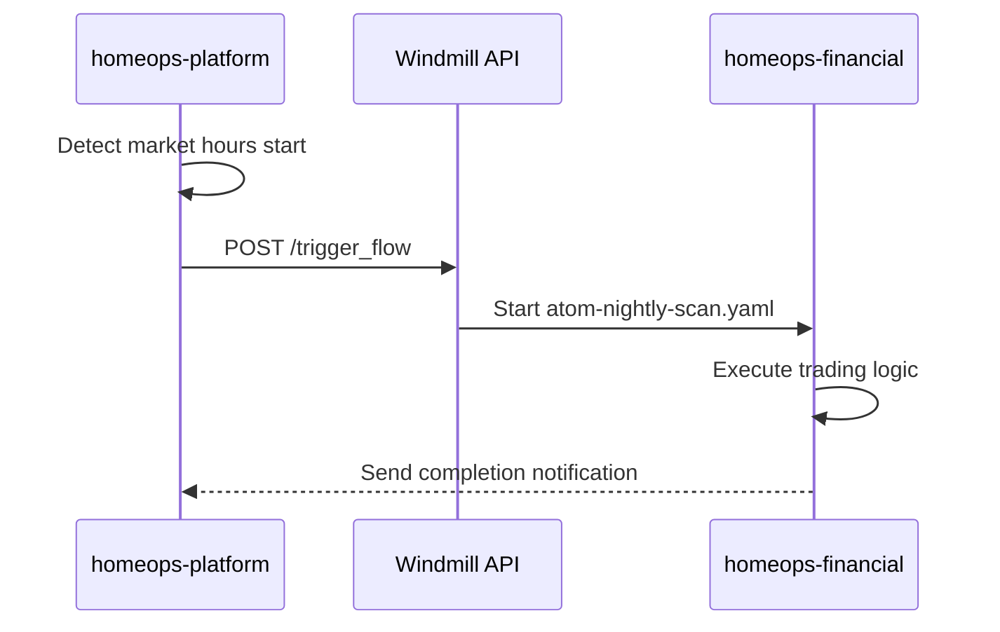
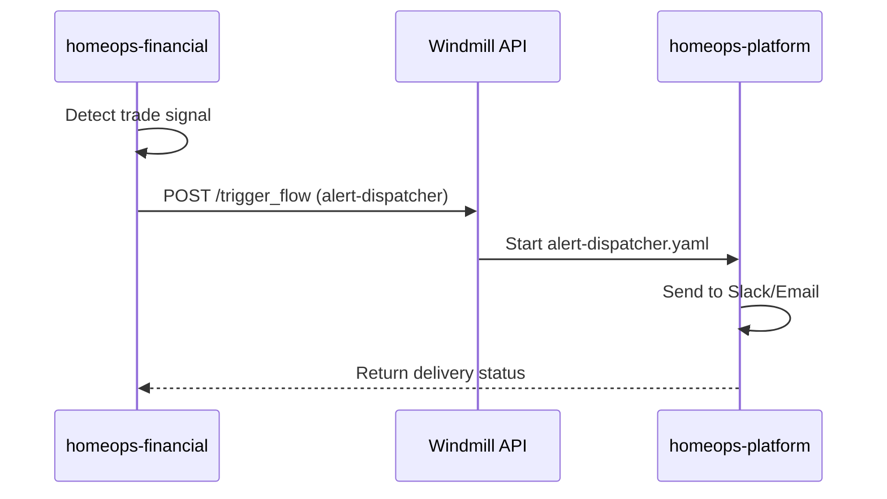

# Windmill Workspace Architecture

**Understanding the Two-Workspace Model for HomeOps**

---

## Executive Summary

HomeOps uses a **dual-workspace architecture** to separate platform-level infrastructure orchestration from domain-specific business logic. This separation provides clean boundaries, independent scaling, and clear ownership while maintaining flexibility for future growth.

```
┌─────────────────────────────────────────────────────────────┐
│                       HOMEOPS PROJECT                        │
│                                                              │
│  ┌────────────────────────┐   ┌───────────────────────────┐ │
│  │  homeops-platform      │   │  homeops-financial        │ │
│  │  (Root windmill/)      │   │  (Subproject windmill/)   │ │
│  │                        │   │                           │ │
│  │  • Infrastructure      │   │  • Trading automation     │ │
│  │  • Deployment          │   │  • Market analysis        │ │
│  │  • Monitoring          │   │  • Signal processing      │ │
│  │  • Maintenance         │   │  • Risk management        │ │
│  └────────────────────────┘   └───────────────────────────┘ │
│                                                              │
│  Future: homeops-media, homeops-music, homeops-smart, etc.  │
└─────────────────────────────────────────────────────────────┘
```

---

## Table of Contents

1. [Architecture Overview](#architecture-overview)
2. [Workspace Definitions](#workspace-definitions)
3. [Directory Mapping](#directory-mapping)
4. [Separation Rationale](#separation-rationale)
5. [Communication Patterns](#communication-patterns)
6. [Extensibility Strategy](#extensibility-strategy)
7. [Deployment Workflows](#deployment-workflows)
8. [Best Practices](#best-practices)
9. [Migration Guide](#migration-guide)

---

## Architecture Overview

### The Two-Workspace Model

HomeOps uses **two independent Windmill workspaces**:

| Workspace | Git Directory | Purpose | Scope |
|-----------|---------------|---------|-------|
| **homeops-platform** | `/windmill/` | Platform infrastructure | System-wide |
| **homeops-financial** | `/subprojects/financial-tracker/windmill/` | ATOM trading system | Domain-specific |

### Key Principles

1. **Separation of Concerns**
   - Platform handles "how the system runs"
   - Subprojects handle "what the system does"

2. **Independent Deployment**
   - Each workspace has its own CI/CD pipeline
   - Changes don't cross-contaminate
   - Different release cadences

3. **Clear Ownership**
   - Platform team owns infrastructure
   - Domain teams own business logic
   - Reduced coordination overhead

4. **Flexible Growth**
   - Add new subproject workspaces as needed
   - Platform provides shared services
   - No architectural changes required

---

## Workspace Definitions

### homeops-platform

**Location**: `/windmill/` (root level)

**Purpose**: Platform-level infrastructure and cross-cutting concerns

**Responsibilities**:
- Docker service health monitoring
- System resource monitoring (CPU, memory, disk)
- Deployment orchestration for all subprojects
- Database maintenance and backups
- Centralized alerting and notifications
- Infrastructure cleanup (logs, old data)
- Security audits and compliance checks
- Network monitoring
- Service availability checks

**Workflow Types**:
- **Infrastructure**: Service health, Docker management
- **Deployment**: Automated deployments, rollbacks
- **Monitoring**: System metrics, alerts
- **Maintenance**: Backups, cleanup, updates

**Resources**:
- Platform databases (PostgreSQL, Redis, TimescaleDB)
- Docker registry credentials
- GitHub API tokens
- Slack webhooks (platform alerts)
- System-level API keys

**Access**: Shared across all subprojects

**Example Workflows**:
```
flows/
├── infrastructure/
│   ├── docker-health-check.yaml
│   ├── service-auto-restart.yaml
│   └── network-monitoring.yaml
├── deployment/
│   ├── deploy-subproject.yaml
│   ├── rollback-deployment.yaml
│   └── verify-deployment.yaml
├── monitoring/
│   ├── system-resources-check.yaml
│   ├── alert-dispatcher.yaml
│   └── weekly-system-report.yaml
└── maintenance/
    ├── database-maintenance.yaml
    ├── docker-image-cleanup.yaml
    └── system-backup.yaml
```

---

### homeops-financial

**Location**: `/subprojects/financial-tracker/windmill/`

**Purpose**: ATOM (Automated Trading Operations Manager) business logic

**Responsibilities**:
- Market data scanning (daily, intraday)
- Signal validation and analysis
- Trade execution automation
- Position monitoring
- Risk management
- Bracket order management
- Trading strategy implementation
- Financial metrics calculation

**Workflow Types**:
- **Scanning**: Market analysis, opportunity detection
- **Validation**: Signal confirmation, pattern recognition
- **Execution**: Trade placement, order management
- **Monitoring**: Position tracking, exit management
- **Risk**: Portfolio risk, exposure limits

**Resources**:
- Alpaca API keys
- FMP (Financial Modeling Prep) API keys
- Trading database credentials
- Slack webhooks (trading alerts)
- Trading-specific configurations

**Access**: Isolated to financial-tracker team

**Example Workflows**:
```
atom-workflows/
├── atom-nightly-scan.yaml
├── atom-monitor-entry.yaml
├── atom-monitor-exits.yaml
├── atom-execute-trades.yaml
└── atom-manage-brackets.yaml
```

---

## Directory Mapping

### Git Repository Structure

```
C:\Projects\HomeOps\
│
├── windmill/                          # → homeops-platform workspace
│   ├── README.md
│   ├── SETUP-GUIDE.md
│   ├── WORKSPACE-ARCHITECTURE.md
│   ├── windmill.config.yaml
│   ├── .env.example
│   │
│   ├── flows/
│   │   ├── infrastructure/
│   │   ├── deployment/
│   │   ├── monitoring/
│   │   └── maintenance/
│   │
│   ├── scripts/
│   │   ├── platform/
│   │   └── integrations/
│   │
│   └── resources/
│
├── subprojects/
│   ├── financial-tracker/
│   │   └── windmill/                 # → homeops-financial workspace
│   │       ├── README.md
│   │       ├── windmill.config.yaml
│   │       ├── workflows/
│   │       └── atom-workflows/
│   │
│   ├── media-stack/
│   │   └── windmill/                 # → future: homeops-media workspace
│   │
│   ├── music-discovery/
│   │   └── windmill/                 # → future: homeops-music workspace
│   │
│   └── smart-home/
│       └── windmill/                 # → future: homeops-smart workspace
│
└── .github/
    └── workflows/
        ├── windmill-sync.yml         # Syncs /windmill/ to homeops-platform
        └── financial-sync.yml        # Syncs financial-tracker to homeops-financial
```

### CI/CD Pipeline Mapping

| Git Path | GitHub Workflow | Windmill Workspace |
|----------|----------------|-------------------|
| `/windmill/**` | `windmill-sync.yml` | `homeops-platform` |
| `/subprojects/financial-tracker/windmill/**` | `financial-sync.yml` | `homeops-financial` |

---

## Separation Rationale

### Why Not One Workspace?

**Option Considered**: Single `homeops` workspace with folders

**Rejected Because**:
1. **Blast Radius**: Infrastructure change could break trading workflows
2. **Access Control**: Can't easily separate platform vs trading permissions
3. **Resource Conflicts**: Shared resources could cause naming collisions
4. **Scaling**: As more subprojects added, workspace becomes unwieldy
5. **Deployment Cadence**: Platform might deploy hourly, trading might deploy daily

### Why Not Many Workspaces Per Subproject?

**Option Considered**: `homeops-financial-dev`, `homeops-financial-staging`, `homeops-financial-prod`

**Rejected Because**:
1. **Overhead**: Too many workspaces to manage (3x for each subproject)
2. **Cost**: Each workspace consumes resources
3. **Complexity**: Hard to track which workspace is which
4. **Simpler Alternative**: Use branches in Git for environments

### The Goldilocks Solution

**Two workspaces per concern**:
- **One platform workspace**: Shared infrastructure
- **One workspace per domain**: Business logic isolation

**Benefits**:
- Clean separation without over-engineering
- Easy to add new domains (one workspace each)
- Platform team and domain teams can work independently
- Resources and permissions cleanly scoped

---

## Communication Patterns

### How Workspaces Interact

Workspaces are **independent but coordinated**.

### Pattern 1: Platform Triggers Subproject

**Scenario**: Platform detects system event, triggers domain workflow



**Implementation**:

```typescript
// In platform workflow (homeops-platform)
import * as wmill from 'windmill-client';

export async function main() {
  // Detect event (e.g., market open)
  const isMarketOpen = await checkMarketHours();

  if (isMarketOpen) {
    // Trigger workflow in different workspace
    await wmill.triggerFlow({
      workspace: 'homeops-financial',
      flow_path: 'atom-nightly-scan',
      args: {
        scan_type: 'full',
        triggered_by: 'platform-scheduler'
      }
    });

    console.log('Triggered financial scan');
  }
}
```

### Pattern 2: Subproject Requests Platform Service

**Scenario**: Trading workflow needs platform to send alert



**Implementation**:

```typescript
// In financial workflow (homeops-financial)
import * as wmill from 'windmill-client';

export async function main() {
  // Detect important event
  const tradeSignal = await detectSignal();

  if (tradeSignal.strength > 0.8) {
    // Request platform to send alert
    const result = await wmill.triggerFlow({
      workspace: 'homeops-platform',
      flow_path: 'monitoring/alert-dispatcher',
      args: {
        alert_type: 'trading-signal',
        severity: 'high',
        message: `Strong signal detected: ${tradeSignal.ticker}`,
        channel: '#trading-alerts'
      }
    });

    console.log('Alert sent via platform:', result);
  }
}
```

### Pattern 3: Shared Data via Database

**Scenario**: Both workspaces read/write to shared database

```
┌─────────────────────┐         ┌─────────────────────┐
│  homeops-platform   │         │ homeops-financial   │
│                     │         │                     │
│  Write: metrics     │────┐    │  Read: market_data  │
│  Read: system_state │    │    │  Write: trades      │
└─────────────────────┘    │    └─────────────────────┘
                           │
                           ▼
                   ┌────────────────┐
                   │   PostgreSQL   │
                   │                │
                   │  Shared Tables │
                   │  • metrics     │
                   │  • events      │
                   │  • logs        │
                   └────────────────┘
```

**Best Practice**: Use database as coordination layer, not direct workspace calls

---

## Extensibility Strategy

### Adding New Subproject Workspaces

As HomeOps grows, add new workspaces for each domain:

```
Future Workspaces:
├── homeops-platform     ✅ (exists)
├── homeops-financial    ✅ (exists)
├── homeops-media        🔮 (planned - media automation)
├── homeops-music        🔮 (planned - music discovery)
├── homeops-smart        🔮 (planned - smart home)
├── homeops-network      🔮 (planned - DNS/network)
└── homeops-community    🔮 (future - marketplace)
```

### Template for New Subproject

```bash
# 1. Create directory structure
mkdir -p subprojects/new-subproject/windmill/{flows,scripts,resources}

# 2. Copy template configuration
cp windmill/windmill.config.yaml subprojects/new-subproject/windmill/
# Edit for domain-specific settings

# 3. Create GitHub Actions workflow
# .github/workflows/new-subproject-sync.yml

# 4. Create Windmill workspace
# In Windmill UI: Create workspace "homeops-new-subproject"

# 5. Configure secrets
# Add WMILL_URL_NEW and WMILL_TOKEN_NEW to GitHub secrets

# 6. Deploy first workflow
git add subprojects/new-subproject/windmill/
git commit -m "Initialize new-subproject Windmill workspace"
git push
```

### Shared Services Pattern

Platform workspace provides **shared services** to all subprojects:

| Service | Provider | Consumers |
|---------|----------|-----------|
| Alerting | homeops-platform | All subprojects |
| Backup | homeops-platform | All subprojects |
| Deployment | homeops-platform | All subprojects |
| Monitoring | homeops-platform | All subprojects |

---

## Deployment Workflows

### Platform Deployment

```yaml
# .github/workflows/windmill-sync.yml

on:
  push:
    branches: [main]
    paths: ['windmill/**']

jobs:
  sync:
    runs-on: ubuntu-latest
    steps:
      - uses: actions/checkout@v4
      - uses: windmill-labs/wmill-action@v3
        with:
          wmill_url: ${{ secrets.WMILL_URL }}
          wmill_token: ${{ secrets.WMILL_TOKEN }}
          path: ./windmill
          command: sync push
```

### Subproject Deployment

```yaml
# .github/workflows/financial-sync.yml

on:
  push:
    branches: [main]
    paths: ['subprojects/financial-tracker/windmill/**']

jobs:
  sync:
    runs-on: ubuntu-latest
    steps:
      - uses: actions/checkout@v4
      - uses: windmill-labs/wmill-action@v3
        with:
          wmill_url: ${{ secrets.WMILL_URL_FINANCIAL }}
          wmill_token: ${{ secrets.WMILL_TOKEN_FINANCIAL }}
          path: ./subprojects/financial-tracker/windmill
          command: sync push
```

---

## Best Practices

### ✅ DO

1. **Keep Platform Generic**
   - Platform workflows should work for any subproject
   - Avoid hard-coding subproject-specific logic in platform

2. **Use Clear Naming**
   - Prefix platform resources: `platform/*`
   - Prefix subproject resources: `financial/*`, `media/*`

3. **Document Dependencies**
   - If subproject depends on platform workflow, document it
   - Version platform workflows if subprojects rely on them

4. **Centralize Common Logic**
   - If multiple subprojects need same logic, move to platform
   - Example: Slack alerting moved to platform

5. **Monitor Cross-Workspace Calls**
   - Log when one workspace triggers another
   - Set up alerts for cross-workspace failures

### ❌ DON'T

1. **Don't Mix Concerns**
   - Don't put trading logic in platform workspace
   - Don't put infrastructure in financial workspace

2. **Don't Share Resources Directly**
   - Each workspace has its own resources
   - Use database or API for data sharing

3. **Don't Create Circular Dependencies**
   - Platform can trigger subprojects: ✅
   - Subprojects can call platform services: ✅
   - Subprojects calling other subprojects: ❌

4. **Don't Skip Documentation**
   - Always document cross-workspace interactions
   - Update this file when adding new workspaces

---

## Migration Guide

### Migrating Existing Workflows

If you have workflows that should move from subproject to platform (or vice versa):

#### From Subproject to Platform

**When**: Workflow is now needed by multiple subprojects

1. **Copy workflow** to platform workspace
2. **Generalize logic** (remove subproject-specific code)
3. **Add parameters** for customization
4. **Test in platform workspace**
5. **Update subproject** to call platform workflow
6. **Remove** old subproject workflow

#### From Platform to Subproject

**When**: Workflow is too domain-specific

1. **Copy workflow** to subproject workspace
2. **Specialize logic** for domain needs
3. **Test in subproject workspace**
4. **Remove** from platform workspace

---

## Conclusion

The two-workspace architecture provides:

✅ **Clear Separation**: Infrastructure vs business logic
✅ **Independent Scaling**: Each workspace scales independently
✅ **Flexible Growth**: Easy to add new subprojects
✅ **Team Autonomy**: Platform and domain teams work independently
✅ **Reduced Complexity**: Simpler than many-workspace model
✅ **Production-Ready**: Battle-tested in financial-tracker

This architecture sets HomeOps up for sustainable growth while maintaining clean boundaries and operational simplicity.

---

**Last Updated**: 2025-01-15
**Version**: 1.0.0
**Workspaces**: homeops-platform, homeops-financial
**Future Expansion**: homeops-media, homeops-music, homeops-smart
